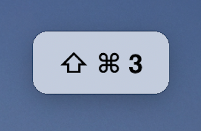
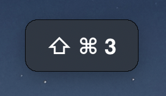

# macos-key-cast [](https://github.com/karaggeorge/macos-key-cast/actions)


> Log keys pressed on macOS. Useful for screen recordings and presentations.

Requires macOS 10.12 or later. macOS 10.13 or earlier needs to download the [Swift runtime support libraries](https://support.apple.com/kb/DL1998).

## Run as CLI

### Using [npx](https://github.com/zkat/npx)

```
$ npx macos-key-cast
```

### Installing

```
$ npm install -g macos-key-cast
$ key-cast
```

### Usage

```
Usage: key-cast [options]

Options:
  -b, --bounds <value>      JSON object with bounds of a rectangle to show the UI in. Example: '{"bounds":[[955,627],[656,384]]}'
  -d, --display <value>     Display number of the screen to show the UI in. Defaults to the main screen.
  -h, --help                Show help information
  -k, --key-combinations    Show key combinations only
  -s, --size <value>        Size of the window and font to use. Defaults to normal
  -t, --delay <value>       How long the key remains on screen in seconds
```

## Node API

### Installation

```
$ npm install macos-key-cast
```

### Usage

```js
const castKeys = require('macos-key-cast');

const process = castKeys({size: 'large', delay: 1.5, keyCombinationsOnly: true});

// Later

process.cancel();
```

### Demo


### Dark Mode support




### API

#### `castKeys(options: object): PCancelable<void>`

Start the process.

The returned promise is an instance of [`PCancelable`](https://github.com/sindresorhus/p-cancelable), so it has a `.cancel()` method which can be used to kill the process

##### `options: object`

Additional options passed to the CLI

###### `options.size: 'small' | 'normal' | 'large'`

Default: `normal`

How big the window and the font should be

###### `options.delay: number`

Default: `0.5`

How long the window should remain on screen after the last key press

###### `options.display: number`

Display id of the screen to show the UI in. Defaults to the main screen.

Note: If you are using electron, you can find the display id in the [Display Object](https://electronjs.org/docs/api/structures/display).

###### `options.keyCombinationsOnly: boolean`

Default: `false`

Whether or not it should track all key presses or only combinations

###### `options.bounds: Object`

An object containing keys `x`, `y`, `width`, `height` defining an area within the display to use for the UI's initial position.

## Contributing

If you want to use this and need more features or find a bug, please open an issue and I'll do my best to implement.

PRs are always welcome as well 😃

## Related

- [mac-focus-window](https://github.com/karaggeorge/mac-focus-window) - Focus a window and bring it to the front on macOS
- [mac-windows](https://github.com/karaggeorge/mac-windows) - Provide Information about Application Windows running
- [macos-accessibility-permissions](https://github.com/karaggeorge/macos-accessibility-permissions) - Check and request macOS accessibility permissions

## License

MIT
